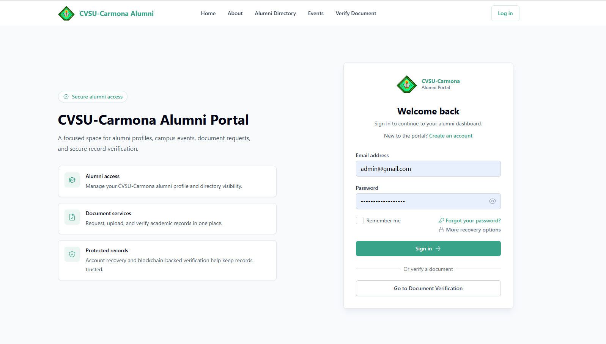
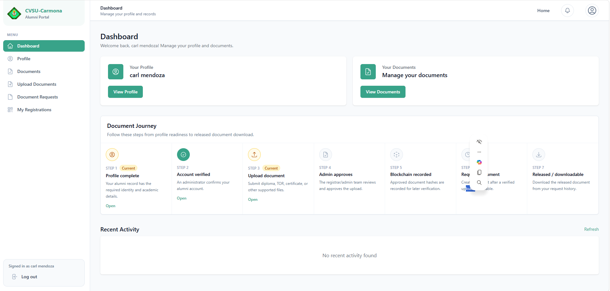
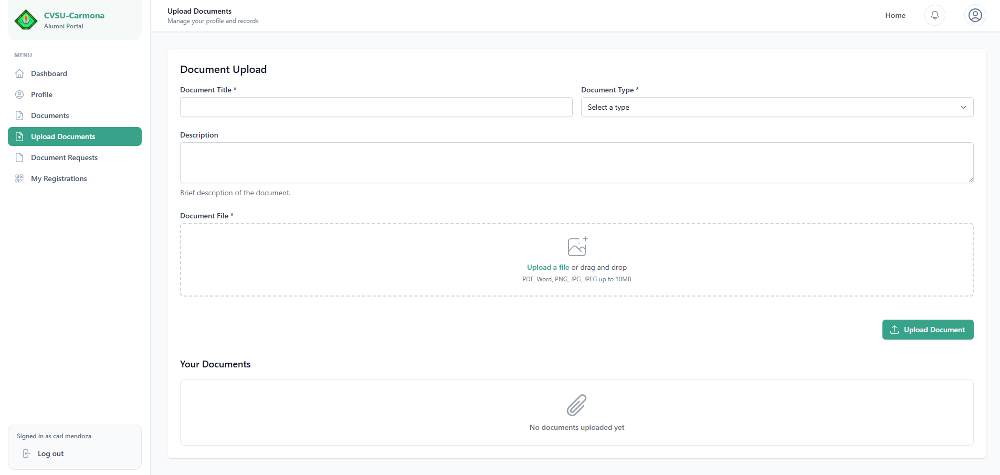
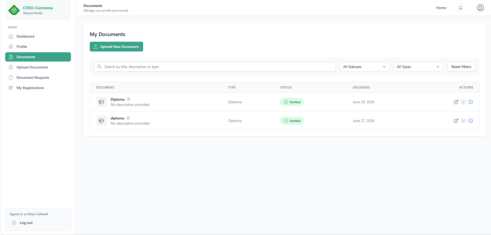
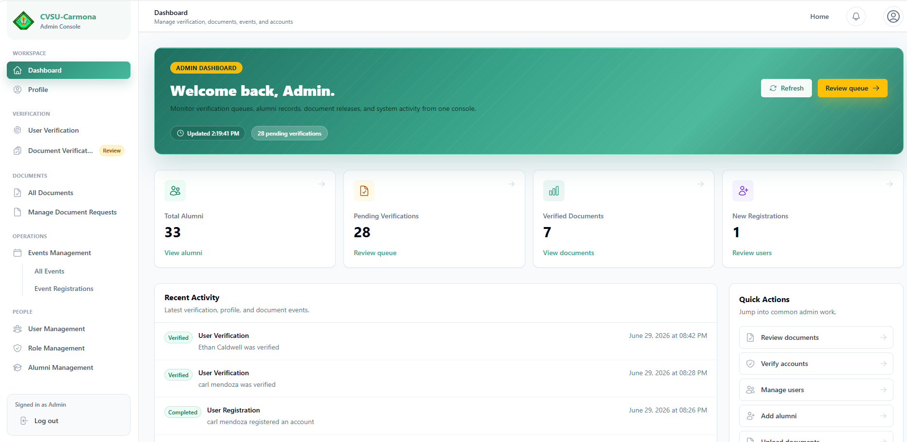
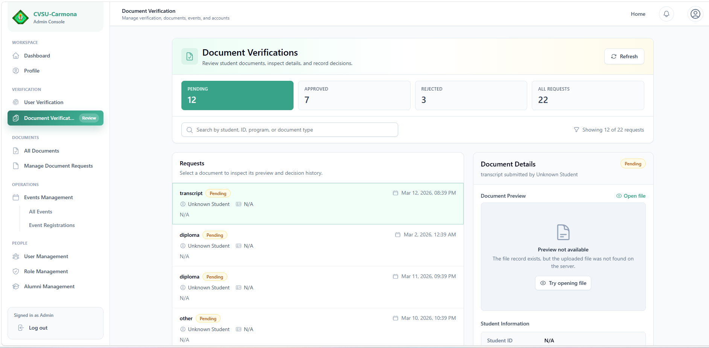

# CVSU Alumni Document Verification

Alumni profiles and tamper-checking for Cavite State University (CVSU) Carmona documents, with SHA-256 hashes recorded on a Hyperledger Fabric ledger.

This is a student capstone (Mark / [Tofuwuuu](https://github.com/Tofuwuuu)) for hiring managers evaluating Hyperledger and full-stack capstone work.

## Status / Demo

The full stack (React UI, FastAPI, MongoDB, and Hyperledger Fabric) runs locally with Docker Compose. There is no public live demo.

An earlier public URL, [https://hyperledger-document-verification.vercel.app/](https://hyperledger-document-verification.vercel.app/), is only the Vite production shell: `index.html`, title "CVSU Document Verification | Blockchain", and hashed `/assets` JS and CSS. Probed on 2026-09-23 it returned HTTP 200. `frontend/vercel.json` rewrites every path to `/index.html`, so `/verify` and `/api/v1` on that host are the same static page. The built client calls `https://api-production-b4b1b.up.railway.app`. Probed the same day, that host returns Railway "Application not found" (HTTP 404). Login, upload, and hash checks on that page have no API behind them. That shell was removed from the portfolio. The screenshots below are captures of the local app.

Compose starts the API with `USE_REAL_BLOCKCHAIN=false`, so approval uses the in-memory mock ledger in `backend/app/blockchain/fabric.py`. A real peer means bringing up the Fabric network in `fabric-network/` and setting `USE_REAL_BLOCKCHAIN=true` (see `backend/.env.example`).

## What it does

| Who | What they can do |
| --- | --- |
| **Public verifier** | Open `/verify` with no login, upload a file, and compare its SHA-256 hash to the ledger. An optional document id checks that specific record. |
| **Alumni** | Register, sign in, edit a profile, and (after an admin verifies the account) upload documents, request official documents, register for events, and read notifications. |
| **Admin** | Approve or reject accounts, review uploaded documents, and on approval try to store the file hash on Fabric. Also manages events, QR check-in, roles, and meetings. |

The ledger stores hashes and small metadata, not the files. Files stay in MongoDB and `backend/uploads/`.

A few limits that matter when you read the code:

- The Fabric network in this repo is a **single-org dev network** (`Org1MSP`, channel `alumni-channel`, chaincode `final-smart-contract`). The gateway signs as the Org1 admin. It is not a multi-organization issuer/verifier consortium.
- `docker-compose.yml` starts the API with `USE_REAL_BLOCKCHAIN=false`, so approval uses the in-memory mock ledger in `backend/app/blockchain/fabric.py`. Set `USE_REAL_BLOCKCHAIN=true` (see `backend/.env.example`) to call the Node gateway.
- If the chain write fails or times out, admin approval still marks the document approved in MongoDB and stores a `mongo-fallback-…` transaction id (`backend/app/api/endpoints/admin.py`).

## Architecture

```text
React (Vite)  --HTTP /api/v1-->  FastAPI  --MongoDB-->  users, documents, events
                                    |
                                    | USE_REAL_BLOCKCHAIN=true
                                    v
                              fabric-gateway (Express)
                                    |  @hyperledger/fabric-gateway (gRPC)
                                    v
                         peer0.org1.example.com
                         chaincode final-smart-contract
                         StoreDocument / VerifyDocument / VerifyHash / GetDocumentHistory
```

Public verify and admin approval both go through `BlockchainManager` (`backend/app/services/blockchain_manager.py`). That class calls `FabricClient` (`backend/app/clients/fabric_client.py`), which HTTP-calls `fabric-gateway/src/server.js`. More detail: [docs/architecture.md](docs/architecture.md).

## Tech stack

| Layer | Stack |
| --- | --- |
| Frontend | React 18, Vite, React Router, Axios, Tailwind CSS, Chakra UI |
| Backend | Python, FastAPI, Uvicorn, Motor (MongoDB), Pydantic |
| Gateway | Node.js, Express, `@hyperledger/fabric-gateway` |
| Chaincode | JavaScript (`fabric-contract-api`) |
| Network | Hyperledger Fabric via Docker, brought up by the PowerShell scripts in `fabric-network/` |
| Data | MongoDB (app data) and the Fabric ledger (hashes) |

`frontend/vercel.json` sets the Vite SPA install (`npm install --legacy-peer-deps`), build (`npm run build`), `dist` output, and a rewrite of every path to `/index.html`. That config is the static shell described above. The API, MongoDB, and Fabric network stay on Compose/local, with `USE_REAL_BLOCKCHAIN=false` unless you opt into the gateway.

## Prerequisites

- Node.js 18+ (gateway image uses Node 20; frontend image uses Node 18)
- Python 3.11
- Docker with Compose
- Windows PowerShell if you use `fabric-network/network-up.ps1` and `deploy-chaincode.ps1` as written

## Run locally

App data and the API, without Fabric (mock ledger, which matches the Compose default):

```bash
docker network create cvsu_alumni_blockchain_network   # once; Compose expects this external network
docker compose up -d --build
cd frontend && npm install --legacy-peer-deps && npm run dev
```

- API: http://127.0.0.1:8000/docs
- Frontend (Vite): http://localhost:5173
- Mongo Express (dev UI): http://localhost:8081

The frontend service in Compose is behind the `docker-frontend` profile, so the command above runs the Vite dev server on the host. Copy `frontend/.env.example` to `frontend/.env` and `backend/.env.example` to `backend/.env` before running either app outside Compose.

To record hashes on a real peer, start Fabric first, deploy chaincode, then set `USE_REAL_BLOCKCHAIN=true`. Step-by-step commands, env vars, and the PowerShell network scripts: [docs/local-setup.md](docs/local-setup.md).

From the repo root, `npm install` then `npm start` runs the API and Vite together (`concurrently`). `npm run install-all` installs root, frontend, gateway, and Python dependencies.

## Project structure

```text
frontend/           React client (routes in src/App.jsx)
backend/            FastAPI app (app/main.py, app/run via run.py)
  app/api/          REST routers under /api/v1
  app/clients/      HTTP client for the Fabric gateway
  app/blockchain/   In-memory mock ledger
fabric-gateway/     Express bridge to the Fabric Gateway SDK
fabric-network/     cryptogen config, Compose file, chaincode, PowerShell up/down scripts
docs/               Architecture and local setup
docker-compose.yml  MongoDB, API, gateway, optional frontend
```

`fabric-samples` is listed in `.gitmodules` and is not required to run this app. `docker-compose.yml` also defines a `blockchain-explorer` nginx container. There is no `blockchain-explorer/` directory in the repo, so that service has no site to serve (Compose may create an empty folder on startup).

## Screenshots

Real captures of this app's UI, checked in under `docs/screenshots/`. The full stack runs locally with Docker Compose. There is no public live demo. Compose uses the in-memory mock ledger unless you set `USE_REAL_BLOCKCHAIN=true` and start Fabric ([docs/local-setup.md](docs/local-setup.md)).

### Login (`/login`)



### Alumni dashboard (`/alumni`)



### Upload document (`/alumni/documents/upload`)



### My documents (`/alumni/documents`)



### Admin dashboard (`/admin`)



### Admin document verification (`/admin/verifications`)



## Documentation

- [docs/architecture.md](docs/architecture.md) — request path and chaincode
- [docs/local-setup.md](docs/local-setup.md) — env files and Fabric startup
- [docs/system-implementation.md](docs/system-implementation.md) — longer module notes
- [fabric-network/README.md](fabric-network/README.md) — peer, orderer, and chaincode deploy

## License

[MIT](LICENSE).
